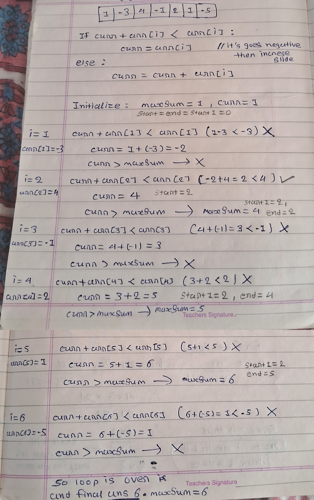

# Largest Subarray Sum

The problem is to find the subarray within a given array that has the maximum sum.

## Solution

Given the array:
```java
int[] arr = {1, -3, 8, -10, 3, 4};
```

## 1. Brute Force Approach 
    - Iterates through all possible subarrays.
    - Calculates and compares the sums.
    - Updates the maximum sum if a larger sum is found.  
- ***Time Complexity:*** O(n^2)
```java
int result = 0, current = 0;
for (int i = 0; i < arr.length; i++) {
    current = 0;  // Reset current at the start of the new subarray
    for (int j = i; j < arr.length; j++) {
        current += arr[j];
        if (current > result)
            result = current;
    }
}
```
```text
-----------------------------------
Brute Force Approach:
Largest sum of Subarray: 8
Time complexity: O(n^2)
-----------------------------------
```

## 2. Optimized Approach
    - Keeps track of the current sum and updates the maximum sum.
    - Resets the current sum to the current element if the current sum becomes less than the current element. 
- ***Time Complexity:*** O(n)
```java
int maxSum = arr[0], curr = arr[0];
for (int i = 1; i < arr.length; i++) {
    curr+arr[i] < arr[i]  ?  curr = arr[i] : curr += arr[i];
    if (curr > maxSum)
        maxSum = curr;
}
```
```text
------------------------------------
Optimize approach:
Largest sum of Subarray: 8
Time complexity: O(n)
------------------------------------
Suppose There are tells to find indices of subarray:
Ans. (4, 5)
------------------------------------
```

## 3. Indices of the Subarray
- For finding the indices of the subarray with the largest sum:
    - Tracks the start and end indices of the subarray with the maximum sum. 
    - Example result: (4, 5)
```java
int maxSum = arr[0], curr = arr[0];

//below variable for finding indices
int start = 0, end = 0, start1 = 0;
//why we need staet1 ? ----> for that dry run code on below example there have only one number as max

for (int i = 1; i < arr.length; i++) {
    if (curr + arr[i] < arr[i]) {
        curr = arr[i];
        start = i;
    } else {
        curr += arr[i];
    }
    if (curr > maxSum) {
        maxSum = curr;
        start1 = start;
        end = i;
    }
}
```
## Dry run  



