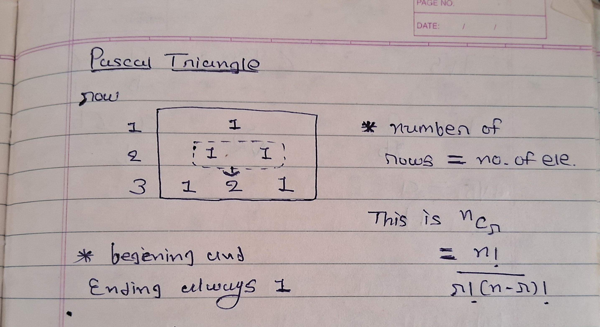
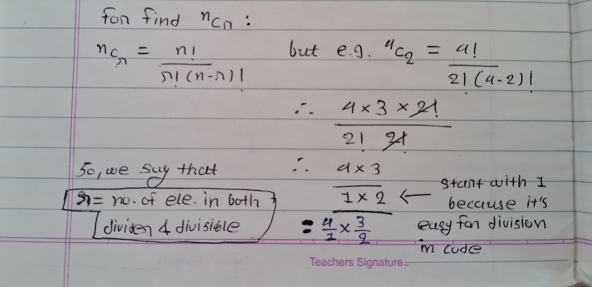
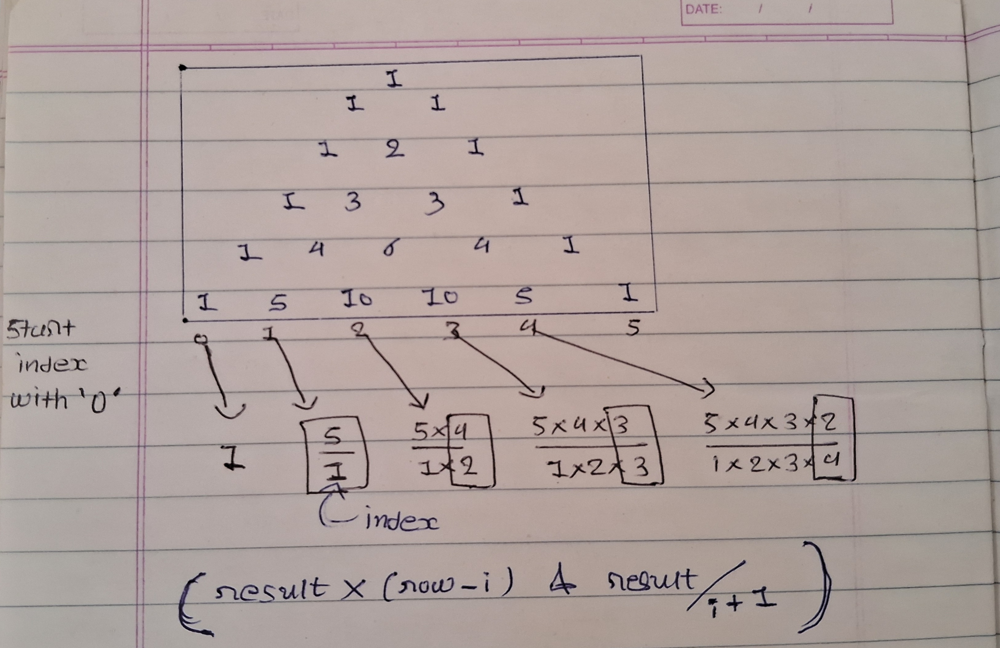

## Pascal's Triangle

  

- Pascal's Triangle is a triangular array of the binomial coefficients, where each number is the number of combinations of a certain size.  



#### Approach



1. The outer loop iterates rows times, where rows is the number of rows in the triangle.

2. The inner loop iterates i times, where i is the current row number. This loop prints the binomial coefficients for the current row.

3. The nCr function calculates the binomial coefficient nCr using the formula:
```
res = res * (n - i) / (i + 1)
```
Above formula is simplified version of n!/r!(n-r)! where we know that similar number of factorial in we remove on both side

so, there we say that number of element on both side consider as number of 'r' and in code we start divide with '1' for simplicity


